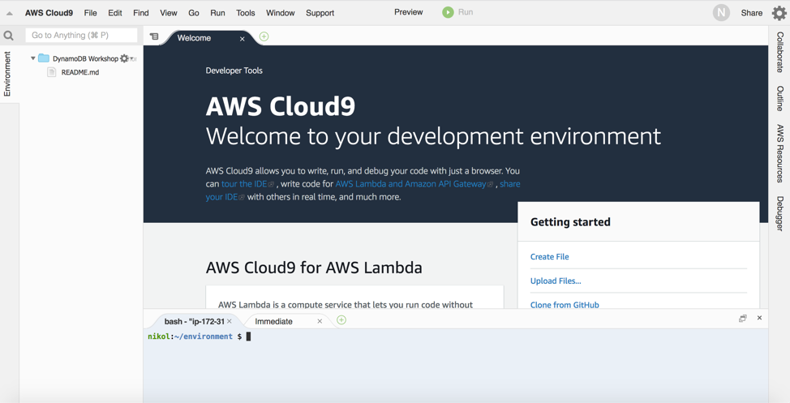

# DynamoDB Practical Workshop
July, 2019 Version

Overview
This lab document is meant to provide some practical exercises of implementing design patters using Amazon DynamoDB. Here's some of what you'll find:
List of exercises:

*	Preparation
*	Exercise 1 - Capacity Units & Partitioning
*	Exercise 2 - Table Scan and Parallel Scan
*	Exercise 3 - GSI write sharding
*	Exercise 4 - GSI key overloading
*	Exercise 5 - Sparse Indexes
*	Exercise 6 - Composite keys
*	Exercise 7 - Transaction locking
*	Exercise 8 - DynamoDB Streams and AWS Lambda

# Who is it for?
*	Developers looking for recommendations
*	Database professionals looking for NoSQL and DynamoDB details
# Requirements
*	Basic experience with AWS
*	Basic knowledge on DynamoDB
*	Some experience with Python

# Preparation 
## Step 1 - Deploy the Cloudformation template.

Click on the "Deploy" link below that references the region assigned to you.

Region| Deploy
------|-----
US East 1 (N.Virginia) | <a href="https://console.aws.amazon.com/cloudformation/home?region=us-east-1#/stacks/new?stackName=DynamoDB-Workshop&templateURL=https://dynamodb-workshop.s3.amazonaws.com/cloudformation_cloud9.json" target="_blank"></a>
US East 2 (Ohio) | <a href="https://console.aws.amazon.com/cloudformation/home?region=us-east-2#/stacks/new?stackName=DynamoDB-Workshop&templateURL=https://dynamodb-workshop.s3.amazonaws.com/cloudformation_cloud9.json" target="_blank"></a>
US West 2 (Oregon) | <a href="https://console.aws.amazon.com/cloudformation/home?region=us-west-2#/stacks/new?stackName=DynamoDB-Workshop&templateURL=https://dynamodb-workshop.s3.amazonaws.com/cloudformation_cloud9.json" target="_blank"></a>

On the CloudFormation wizard just follow clicking on "Next" button until you have the option to click on "Create Stack" button and wait to the creation of the stack.

Once the stack is created, navigate to the Cloud9 console as the image below.


It will bring you to the Cloud9 console where you will find an Environment named "DynamoDB-Workshop-Environmet", click on the "Open IDE" button.


Wait a few moments and you will be redirected to the IDE of your new environment.

At the botton of the screen you have access to a terminal.
In this workshop you will use this terminal to run all the commands. 
Few free to explore the IDE.



## Step 2 – Download and Check the content of the workshop folder

Download content:

```
aws s3 cp s3://hugorozestraten.net/dynamodbws/workshop.zip .
mkdir workshop
cd workshop
unzip ../workshop.zip
```

Go to the workshop folder and run the ls command:

```
cd /home/ec2-user/workshop
ls -l .
```

You will see the following content:

#### Python code:

*	ddbreplica_lambda.py
*	load_employees.py
*	load_tlog_parallel.py
*	load_tlog.py
*	query_city_dept.py
*	query_employees.py
*	query_managers_gsi.py
*	query_managers_table.py
*	scan_tlog_parallel.py
*	scan_tlog_simple.py
*	update_employees.py

#### JSON:

*	gsi_city_dept.json
*	gsi_manager.json
*	iam-role-policy.json
*	iam-trust-relationship.json

Run the ls command to show the sample data files:

```
ls -l ./data
```

#### ./data

*	employees.csv
*	logfile_medium1.csv
*	logfile_medium2.csv
*	logfile_small1.csv
*	logfile_stream.csv


## Step 3 - Check the files format and content

You will be working with two different data contents during this lab: (1)Server logging data and (2)Employees data.
The log files have the following structure:

*	requestid (number)
*	host (string)
*	date (string)
*	hourofday (number)
*	timezone (string)
*	method (string)
*	url (string)
*	responsecode (number)
*	bytessent (number)
*	useragent (string)

To view a sample record in the file, execute:

```
head ./data/logfile_small1.csv -n 1
```

Sample log record:

```1,66.249.67.3,2017-07-20,20,GMT-0700,GET,"/gallery/main.php?g2_controller=exif.SwitchDetailMode&g2_mode=detailed&g2_return=%2Fgallery%2Fmain.php%3Fg2_itemId%3D15741&g2_returnName=photo",302,5,"Mozilla/5.0 (compatible; Googlebot/2.1; +http://www.google.com/bot.html)"```

The employees files have the following structure:

*	employeeid (number)
*	name (string)
*	title (string)
*	dept (string)
*	city (string)
*	state (string)
*	dob (string)
*	hire_date (string)
*	previous title (string)
*	previous title end date (string)
*	is a manager (string), 1 for manager employees, non-existent for others

To view a sample record in the file, execute:

```
head ./data/employees.csv -n 1
```
Sample employee record:

```
1,Onfroi Greeno,Systems Administrator,Operation,Portland,OR,1992-03-31,2014-10-24,Application Support Analyst,2014-04-12
```

## Step 4 - Preload the items for the scan exercise

In the exercise 2 we will discuss table scan and the alternatives. In this step, you are going to load the table with 1 milliton rows in preparation for the exercise.
Run the command to create a new table:

```
aws dynamodb create-table --table-name tlog_scan \
--attribute-definitions AttributeName=requestid,AttributeType=N AttributeName=gsi_responsecode_hk,AttributeType=N AttributeName=gsi_responsecode_sk,AttributeType=S \
--key-schema AttributeName=requestid,KeyType=HASH \
--provisioned-throughput ReadCapacityUnits=5000,WriteCapacityUnits=5000 \
--global-secondary-indexes  IndexName=gsi_responsecode,\
KeySchema=["{AttributeName=gsi_responsecode_hk,KeyType=HASH},{AttributeName=gsi_responsecode_sk,KeyType=RANGE}"],\
Projection="{ProjectionType=KEYS_ONLY}",\
ProvisionedThroughput="{ReadCapacityUnits=3000,WriteCapacityUnits=5000}"
```

This command will create a new table and one GSI with the following definition:

Table: tlog_scan

*	Attribute: requestid
*	Key Type: Hash
*	Table RCU = 5000
*	Table WCU = 5000

Run the command to wait until the table becomes Active:

```
aws dynamodb wait table-exists --table-name tlog_scan
```

Populate the table

Run the following command to load the server logs data into the tlog_scan table. It will load 78688 rows to the table.

```
python load_tlog_parallel.py tlog_scan
```
```total rows 1000000 in 514.663530111 seconds```

# Exercise 1: DynamoDB Capacity Units & Partitioning
In this exercise you will load data into DynamoDB tables that are provisioned with different Write/Read capacity units, and compare the load times. You will be using the “log” data.

##### Open a Second terminal in your Cloud9 IDE by clicking on the "+" icon next to the Terminal's tab.
 
#### Step 1 – Create the DynamoDB table
Run the following AWS CLI command to create the first DynamoDB table called 'tlog':
```
aws dynamodb create-table --table-name tlog \
--attribute-definitions AttributeName=requestid,AttributeType=N AttributeName=host,AttributeType=S \
--key-schema AttributeName=requestid,KeyType=HASH \
--provisioned-throughput ReadCapacityUnits=5,WriteCapacityUnits=5 \
--global-secondary-indexes  IndexName=host-requestid-gsi,\
KeySchema=["{AttributeName=host,KeyType=HASH},{AttributeName=requestid,KeyType=RANGE}"],\
Projection="{ProjectionType=INCLUDE,NonKeyAttributes=['bytessent']}",\
ProvisionedThroughput="{ReadCapacityUnits=5,WriteCapacityUnits=5}"
```

The table you just created will have the following structure.

Table:
*	Name: tlog
*	Partition Key: requestid
*	Table RCU = 5
*	Table WCU = 5

GSI:
*	Name: host-requestid-gsi
*	Partition Key: host
*	Sort Key: requestid
*	Projection Include: bytessent
*	GSI RCU = 5
*	GSI WCU = 5

Run the command to wait until the table becomes Active:

```
aws dynamodb wait table-exists --table-name tlog
```

You can run the following command to get only the table status:

```
aws dynamodb describe-table --table-name tlog | grep TableStatus
```

#### Step 2 - Load sample data into the table

Now that you have the table created, you can load some sample data running the Python script:

```
python load_tlog.py tlog ./data/logfile_small1.csv
```

Parameters in the above command:
1) Table Name = tlog
2) File Name = logfile_small1.csv

The output should be like:

``` 
row: 100 in 0.790903091431
row: 200 in 0.746693134308
row: 300 in 0.797533035278
row: 400 in 0.695877075195
row: 500 in 0.715097904205 
RowCount: 500, Total seconds: 3.79715394974
```

#### Step 3 - Load a larger file to compare the execution time

Run the script again but at this time with a larger input data file:

```
python load_tlog.py tlog ./data/logfile_medium1.csv
```

Parameters:
1) Table Name = tlog
2) File Name = logfile_medium1.csv

The output should be like:

```
row: 100 in 0.490761995316
row: 200 in 0.449488162994
row: 300 in 0.450911045074
row: 400 in 0.450123071671
row: 500 in 0.445238828659
row: 600 in 0.58230304718
row: 700 in 0.581787824631
row: 800 in 0.595230102539
row: 900 in 0.588124990463
row: 1000 in 0.589934110641
row: 1100 in 0.588397979736
row: 1200 in 5.44571805
row: 1300 in 19.9914531708
row: 1400 in 20.033246994
row: 1500 in 19.9791162014
row: 1600 in 20.0433659554
row: 1700 in 19.9400119781
row: 1800 in 20.002464056
row: 1900 in 19.998513937
row: 2000 in 20.0029530525
RowCount: 2000, Total seconds: 171.298333883
```

#### After loading some rows, the load time increased. In the sample output, the time increased from less than 1 sec to around 20 seconds.

#### Step 4 - View the CloudWatch metrics on your table

Open the browser tab in the AWS console. If you don't have the AWS console opened, see the step 2 of the Preparation section above.

Refresh the page if necessary to be able to see the left menu.

On the left menu, click Tables, on the table click "Metrics".


