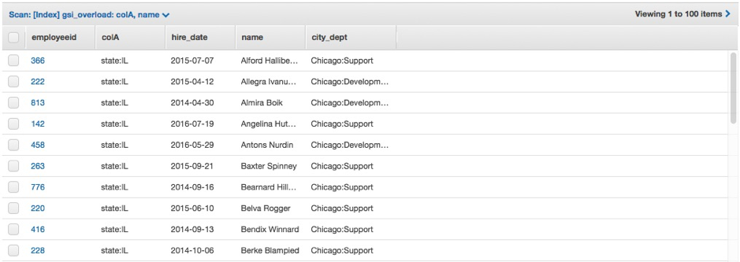
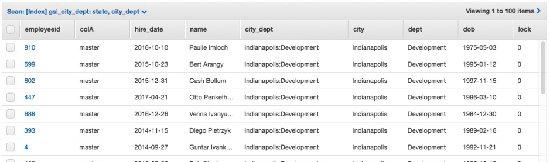

# DynamoDB Practical Workshop
July, 2019 Version

Overview
This lab document is meant to provide some practical exercises of implementing design patters using Amazon DynamoDB. Here's some of what you'll find:
List of exercises:

*	Preparation
*	Exercise 1 - Capacity Units & Partitioning
*	Exercise 2 - Table Scan and Parallel Scan
*	Exercise 3 - GSI write sharding
*	Exercise 4 - GSI key overloading
*	Exercise 5 - Sparse Indexes
*	Exercise 6 - Composite keys
*	Exercise 7 - Transaction locking
*	Exercise 8 - DynamoDB Streams and AWS Lambda

# Who is it for?
*	Developers looking for recommendations
*	Database professionals looking for NoSQL and DynamoDB details
# Requirements
*	Basic experience with AWS
*	Basic knowledge on DynamoDB
*	Some experience with Python

# Preparation 
## Step 1 - Deploy the Cloudformation template.

Click on the "Deploy" link below that references the region assigned to you.

Region| Deploy
------|-----
US East 1 (N.Virginia) | <a href="https://console.aws.amazon.com/cloudformation/home?region=us-east-1#/stacks/new?stackName=DynamoDB-Workshop&templateURL=https://dynamodb-workshop.s3.amazonaws.com/cloudformation_cloud9.json" target="_blank"></a>
US East 2 (Ohio) | <a href="https://console.aws.amazon.com/cloudformation/home?region=us-east-2#/stacks/new?stackName=DynamoDB-Workshop&templateURL=https://dynamodb-workshop.s3.amazonaws.com/cloudformation_cloud9.json" target="_blank"></a>
US West 2 (Oregon) | <a href="https://console.aws.amazon.com/cloudformation/home?region=us-west-2#/stacks/new?stackName=DynamoDB-Workshop&templateURL=https://dynamodb-workshop.s3.amazonaws.com/cloudformation_cloud9.json" target="_blank"></a>
EU West 1 (Ireland) | <a href="https://console.aws.amazon.com/cloudformation/home?region=eu-west-1#/stacks/new?stackName=DynamoDB-Workshop&templateURL=https://dynamodb-workshop.s3.amazonaws.com/cloudformation_cloud9.json" target="_blank"></a>


On the CloudFormation wizard just follow clicking on "Next" button until you have the option to click on "Create Stack" button and wait to the creation of the stack.

Once the stack is created, navigate to the Cloud9 console as the image below.


It will bring you to the Cloud9 console where you will find an Environment named "DynamoDB-Workshop-Environmet", click on the "Open IDE" button.


Wait a few moments and you will be redirected to the IDE of your new environment.

At the botton of the screen you have access to a terminal.
In this workshop you will use this terminal to run all the commands. 
Few free to explore the IDE.


## Step 2 – Download and Check the content of the workshop folder

Download content:

```
aws s3 cp s3://hugorozestraten.net/dynamodbws/workshop.zip .
mkdir workshop
cd workshop
unzip ../workshop.zip
```

Go to the workshop folder and run the ls command:

```
cd /home/ec2-user/workshop
ls -l .
```

You will see the following content:

#### Python code:

*	ddbreplica_lambda.py
*	load_employees.py
*	load_tlog_parallel.py
*	load_tlog.py
*	query_city_dept.py
*	query_employees.py
*	query_managers_gsi.py
*	query_managers_table.py
*	scan_tlog_parallel.py
*	scan_tlog_simple.py
*	update_employees.py

#### JSON:

*	gsi_city_dept.json
*	gsi_manager.json
*	iam-role-policy.json
*	iam-trust-relationship.json

Run the ls command to show the sample data files:

```
ls -l ./data
```

#### ./data

*	employees.csv
*	logfile_medium1.csv
*	logfile_medium2.csv
*	logfile_small1.csv
*	logfile_stream.csv


## Step 3 - Check the files format and content

You will be working with two different data contents during this lab: (1)Server logging data and (2)Employees data.
The log files have the following structure:

*	requestid (number)
*	host (string)
*	date (string)
*	hourofday (number)
*	timezone (string)
*	method (string)
*	url (string)
*	responsecode (number)
*	bytessent (number)
*	useragent (string)

To view a sample record in the file, execute:

```
head ./data/logfile_small1.csv -n 1
```

Sample log record:

```1,66.249.67.3,2017-07-20,20,GMT-0700,GET,"/gallery/main.php?g2_controller=exif.SwitchDetailMode&g2_mode=detailed&g2_return=%2Fgallery%2Fmain.php%3Fg2_itemId%3D15741&g2_returnName=photo",302,5,"Mozilla/5.0 (compatible; Googlebot/2.1; +http://www.google.com/bot.html)"```

The employees files have the following structure:

*	employeeid (number)
*	name (string)
*	title (string)
*	dept (string)
*	city (string)
*	state (string)
*	dob (string)
*	hire_date (string)
*	previous title (string)
*	previous title end date (string)
*	is a manager (string), 1 for manager employees, non-existent for others

To view a sample record in the file, execute:

```
head ./data/employees.csv -n 1
```
Sample employee record:

```
1,Onfroi Greeno,Systems Administrator,Operation,Portland,OR,1992-03-31,2014-10-24,Application Support Analyst,2014-04-12
```

## Step 4 - Preload the items for the scan exercise

In the exercise 2 we will discuss table scan and the alternatives. In this step, you are going to load the table with 1 milliton rows in preparation for the exercise.
Run the command to create a new table:

```
aws dynamodb create-table --table-name tlog_scan \
--attribute-definitions AttributeName=requestid,AttributeType=N AttributeName=gsi_responsecode_hk,AttributeType=N AttributeName=gsi_responsecode_sk,AttributeType=S \
--key-schema AttributeName=requestid,KeyType=HASH \
--provisioned-throughput ReadCapacityUnits=5000,WriteCapacityUnits=5000 \
--global-secondary-indexes  IndexName=gsi_responsecode,\
KeySchema=["{AttributeName=gsi_responsecode_hk,KeyType=HASH},{AttributeName=gsi_responsecode_sk,KeyType=RANGE}"],\
Projection="{ProjectionType=KEYS_ONLY}",\
ProvisionedThroughput="{ReadCapacityUnits=3000,WriteCapacityUnits=5000}"
```

This command will create a new table and one GSI with the following definition:

Table: tlog_scan

*	Attribute: requestid
*	Key Type: Hash
*	Table RCU = 5000
*	Table WCU = 5000

Run the command to wait until the table becomes Active:

```
aws dynamodb wait table-exists --table-name tlog_scan
```

Populate the table

Run the following command to load the server logs data into the tlog_scan table. It will load 78688 rows to the table.

```
python load_tlog_parallel.py tlog_scan
```
```total rows 1000000 in 514.663530111 seconds```

# Exercise 1: DynamoDB Capacity Units & Partitioning
In this exercise you will load data into DynamoDB tables that are provisioned with different Write/Read capacity units, and compare the load times. You will be using the “log” data.

##### Open a Second terminal in your Cloud9 IDE by clicking on the "+" icon next to the Terminal's tab.
 
## Step 1 – Create the DynamoDB table
Run the following AWS CLI command to create the first DynamoDB table called 'tlog':
```
aws dynamodb create-table --table-name tlog \
--attribute-definitions AttributeName=requestid,AttributeType=N AttributeName=host,AttributeType=S \
--key-schema AttributeName=requestid,KeyType=HASH \
--provisioned-throughput ReadCapacityUnits=5,WriteCapacityUnits=5 \
--global-secondary-indexes  IndexName=host-requestid-gsi,\
KeySchema=["{AttributeName=host,KeyType=HASH},{AttributeName=requestid,KeyType=RANGE}"],\
Projection="{ProjectionType=INCLUDE,NonKeyAttributes=['bytessent']}",\
ProvisionedThroughput="{ReadCapacityUnits=5,WriteCapacityUnits=5}"
```

The table you just created will have the following structure.

Table:
*	Name: tlog
*	Partition Key: requestid
*	Table RCU = 5
*	Table WCU = 5

GSI:
*	Name: host-requestid-gsi
*	Partition Key: host
*	Sort Key: requestid
*	Projection Include: bytessent
*	GSI RCU = 5
*	GSI WCU = 5

Run the command to wait until the table becomes Active:

```
aws dynamodb wait table-exists --table-name tlog
```

You can run the following command to get only the table status:

```
aws dynamodb describe-table --table-name tlog | grep TableStatus
```

## Step 2 - Load sample data into the table

Now that you have the table created, you can load some sample data running the Python script:

```
python load_tlog.py tlog ./data/logfile_small1.csv
```

Parameters in the above command:
1) Table Name = tlog
2) File Name = logfile_small1.csv

The output should be like:

``` 
row: 100 in 0.790903091431
row: 200 in 0.746693134308
row: 300 in 0.797533035278
row: 400 in 0.695877075195
row: 500 in 0.715097904205 
RowCount: 500, Total seconds: 3.79715394974
```

## Step 3 - Load a larger file to compare the execution time

Run the script again but at this time with a larger input data file:

```
python load_tlog.py tlog ./data/logfile_medium1.csv
```

Parameters:
1) Table Name = tlog
2) File Name = logfile_medium1.csv

The output should be like:

```
row: 100 in 0.490761995316
row: 200 in 0.449488162994
row: 300 in 0.450911045074
row: 400 in 0.450123071671
row: 500 in 0.445238828659
row: 600 in 0.58230304718
row: 700 in 0.581787824631
row: 800 in 0.595230102539
row: 900 in 0.588124990463
row: 1000 in 0.589934110641
row: 1100 in 0.588397979736
row: 1200 in 5.44571805
row: 1300 in 19.9914531708
row: 1400 in 20.033246994
row: 1500 in 19.9791162014
row: 1600 in 20.0433659554
row: 1700 in 19.9400119781
row: 1800 in 20.002464056
row: 1900 in 19.998513937
row: 2000 in 20.0029530525
RowCount: 2000, Total seconds: 171.298333883
```

#### After loading some rows, the load time increased. In the sample output, the time increased from less than 1 sec to around 20 seconds.

## Step 4 - View the CloudWatch metrics on your table

Open the browser tab in the AWS console. If you don't have the AWS console opened, see the step 2 of the Preparation section above.

Refresh the page if necessary to be able to see the left menu.

On the left menu, click Tables, on the table click "Metrics".


You see the metrics like the sample below:


##### Question: Why there are throttling events on the table and there are not on the GSI?

## Step 5 – Increase the capacity

Run the following AWS CLI command to increase the WCU and RCU from 5 to 100.

```
aws dynamodb update-table --table-name tlog \
--provisioned-throughput ReadCapacityUnits=100,WriteCapacityUnits=100
```

Run the command to wait until the table becomes Active.

```
aws dynamodb wait table-exists --table-name tlog
```

##### Question: How long did it take for increasing the capacity?

## Step 6 - Load more data with the new capacity

After the update, run the Python script again to populate the table with file logfile_medium2.csv with the same number of rows of the previous run. You will see that at this time the execution will be faster.

```
python load_tlog.py tlog ./data/logfile_medium2.csv
```

The output should show a result like:

```
row: 100 in 0.678274869919
row: 200 in 0.637241125107
row: 300 in 0.623446941376
row: 400 in 0.666973114014
row: 500 in 0.694450139999
row: 600 in 0.643283843994
row: 700 in 0.644812107086
row: 800 in 0.63000702858
row: 900 in 0.76971411705
row: 1000 in 0.684530973434
row: 1100 in 0.667228937149
row: 1200 in 0.66502404213
row: 1300 in 0.681458950043
row: 1400 in 0.644996166229
row: 1500 in 0.657227993011
row: 1600 in 0.650546073914
row: 1700 in 0.643900156021
row: 1800 in 0.62757897377
row: 1900 in 0.646264076233
row: 2000 in 0.701603889465
RowCount: 2000, Total seconds: 13.3077070713
```

##### Note: With the new capacity the load time was consistent for the whole dataset.

## Step 7 – Low capacity GSI

For the next step, we are going to create a new table with different capacity units. At this time, the GSI will have on 1 WCU and 1 RCU, for the purpose of this exercise.

Run the following command:

```
aws dynamodb create-table --table-name tlog_gsi_low \
--attribute-definitions AttributeName=requestid,AttributeType=N AttributeName=host,AttributeType=S \
--key-schema AttributeName=requestid,KeyType=HASH \
--provisioned-throughput ReadCapacityUnits=1000,WriteCapacityUnits=1000 \
--global-secondary-indexes  IndexName=host-requestid-gsi,\
KeySchema=["{AttributeName=host,KeyType=HASH},{AttributeName=requestid,KeyType=RANGE}"],\
Projection="{ProjectionType=INCLUDE,NonKeyAttributes=['bytessent']}",\
ProvisionedThroughput="{ReadCapacityUnits=1,WriteCapacityUnits=1}"
```

Run the command to wait until the table becomes Active:

```
aws dynamodb wait table-exists --table-name tlog_gsi_low
```

This command will create a new table and one GSI with the following definition:

Table: tlog_gsi_low

*	Attribute: requestid
*	Key Type: Hash
*	Table RCU = 1000
*	Table WCU = 1000

GSI: host-requestid-gsi

*	Attribute: host
*	Key Type: Hash
*	Attribute: requestid
*	Key Type: Range
*	Projection Include: bytessent
*	GSI RCU = 1
*	GSI WCU = 1
*	

You can, now, populate the new table with a large dataset. At this time, you will run a script that uses a multi-thread version to have more writes per second on the DynamoDB table.

```
python load_tlog_parallel.py tlog_gsi_low
```

Eventually, the execution will be throttled and show the error message like below:

```Error:Error: (, ProvisionedThroughputExceededException(u'An error occurred (ProvisionedThroughputExceededException) when calling the PutItem operation (reached max retries: 9): The level of configured provisioned throughput for one or more global secondary indexes of the table was exceeded. Consider increasing your provisioning level for the under-provisioned global secondary indexes with the UpdateTable API',), )```

You can cancel the operation, typing Ctrl+C. It can take some time to cancel.

##### Note: This new table has more RCU=1000 and WCU=1000 but we received an error and the load time increased.

##### Question: Could you explain the behavior of the test?

Open the AWS console to view the metrics for the table tlog_gsi_low.


Note above that the consumed writes were below the provisioned writes for the table during the test.


Note above that the consumed writes were high than the provisioned writes for the GSI.


Note that the table was throttled, even having enough write capacity.


# Exercise 2 - Table Scan and Parallel Table Scan

This exercise will demonstrate the two methods of table scan, sequential and parallel.

Even though DynamoDB distributes a large table data across multiple physical partitions, a Scan operation can only read one partition at a time. For this reason, the throughput of a Scan is constrained by the maximum throughput of a single partition.
To address these issues, the Scan operation can logically divide a table or secondary index into multiple segments, with multiple application workers scanning the segments in parallel.

## Step 1 – Execute a simple Scan
Imagine you need to calculate the total of bytes sent for all records with response code <> 200.

You can run a scan operation with a filter expression to filter out the uninteresting records. The application will them sum up the values of all the returned records where response code <> 200.

The Python file scan_tlog_simple.py has the command to do the scan with filter and sum the value of bytes sent.

Take a look at the code block for the scan the table:

```
  fe = "responsecode <> :f"
  eav = {":f": 200}
  response = table.scan(
    FilterExpression=fe,
    ExpressionAttributeValues=eav,
    Limit=pageSize
  )
```

Notice how there is a Limit parameter set in the scan command. A single Scan operation will read up to the maximum number of items set (if using the Limit parameter) or a maximum of 1 MB of data and then apply any filtering to the results using FilterExpression. If the total number of scanned items exceeds the maximum set by the limit parameter (or) the data set size limit of 1 MB, the scan stops and results are returned to the user as a LastEvaluatedKey value, which can then be used in a subsequent operation, so that you can pick up where you left off.

See the code below. 
The LastEvaluatedKey value in the response is then passed to the subsequent scan method via the ExclusiveStartKey parameter.

```
  while 'LastEvaluatedKey' in response:
    page += 1
    response = table.scan(
      FilterExpression=fe,
      ExpressionAttributeValues=eav,
      Limit=pageSize,
      ExclusiveStartKey=response['LastEvaluatedKey'])
    for i in response['Items']:
      totalbytessent += i['bytessent']
```

When the last page is returned, LastEvaluatedKey is not part of the response, so you will know that the scan is complete.

Now lets execute this code we just discussed:

```
python scan_tlog_simple.py tlog_scan
```

Parameters:

*	Tablename: tlog_scan

Output:

```
Scanning 1 million rows of table tlog_scan to get the total of bytes sent
Total bytessent 6054250 in 23.5063591003 seconds
```

Note down the time it took for the scan to complete.

## Step 2 – Execute a parallel scan

To perform a parallel scan, each worker issues its own Scan request with the following parameters:

*	**Segment** -- A segment to be scanned by a particular worker. Each worker should use a different value for Segment.
*	**TotalSegments** -- The total number of segments for the parallel scan. This value must be the same as the number of workers that your application will use.

Take a look at the code block from the scan_tlog_parallel.py for the parallel scan.

We need to include the parameters:

**Segment:** For a parallel Scan request, Segment identifies an individual segment to be scanned by an application worker.

**TotalSegments:** For a parallel Scan request, TotalSegments represents the total number of segments into which the Scan operation will be divided. The value of TotalSegments corresponds to the number of application workers that will perform the parallel scan.

```
  fe = "responsecode <> :f"
  eav = {":f": 200}
  response = table.scan(
    FilterExpression=fe,
    ExpressionAttributeValues=eav,
    Limit=pageSize,
    TotalSegments=totalsegments,
    Segment=threadsegment
  )
```
And after the first scan, we can continue scanning the table until LastEvaluatedKey equals null.
 
``` 
  while 'LastEvaluatedKey' in response:
    page += 1
    response = table.scan(
      FilterExpression=fe,
      ExpressionAttributeValues=eav,
      Limit=pageSize,
      TotalSegments=totalsegments,
      Segment=threadsegment,
      ExclusiveStartKey=response['LastEvaluatedKey'])
```
To run the code execute the following command:

```
python scan_tlog_parallel.py tlog_scan 8
```

Parameters:
1) Table name: tlog_scan
2) Number of threads: 8 << - - number of threads to be executed in parallel, it will be used for number of segments as well.

Output:

```
Scanning 1 million rows of table tlog_scan to get the total of bytes sent
Total bytessent 6054250 in 11.1443469524 seconds
```

*	Note: The execution time using parallel scan will be shorter than the execution time for a regular scan. The difference will be even bigger for larger tables. *

# Exercise 3 – GSI Write Sharding
If we need to query the log using the response code, it is possible to create a GSI using that field. 
But the record logs do not have an even distribution by response code. For example, the code "200 OK" has much more records than the others as expected for any application. You can see the distribution of the log records by response code for the sample file "logfile_medium1.csv" in the graph below.


One way to increase the write and read throughput of the application would be to randomize the writes across multiple partition key values. You can create a random number from a fixed set (for example, 1 to 10) and use this number as the hash key for a GSI. Because you are randomizing the partition key, the writes to the table are spread evenly across all of the partition key values independent of any attribute; this will yield better parallelism and higher overall throughput.
If you need, for example, to query the log records by a specific response code in a specific date, you can create a sort key using a composition of the response code and the date.
In this exercise, we will create a GSI using the random values for the Hash Key and the composite key "responsecode#date#hourofday" as the Sort Key. The table tlog_scan created and populated during the preparation phase of the workshop already has these two attributes. The attributes were created using the following code:

```
SHARDS = 10
newitem['gsi_responsecode_hk'] = (newitem['requestid'] % SHARDS) + 1
newitem['gsi_responsecode_sk'] = row[7] + "#" + row[2] + "#" + row[3]
```

## Step 1 - Creating the GSI
The GSI for this exercise was created durint the Step 4 of the preparation phase. You can see the description of the GSI executing the following command:

```
aws dynamodb describe-table --table-name tlog_scan
```

You will see the description of the Global Secondary Indexes, like:

```
   "GlobalSecondaryIndexes": [
        {
            "IndexSizeBytes": 0,
            "IndexName": "gsi_responsecode",
            "Projection": {
                "ProjectionType": "KEYS_ONLY"
            },
            "ProvisionedThroughput": {
                "NumberOfDecreasesToday": 0,
                "WriteCapacityUnits": 5000,
                "ReadCapacityUnits": 3000
            },
            "IndexStatus": "ACTIVE",
            "KeySchema": [
                {
                    "KeyType": "HASH",
                    "AttributeName": "gsi_responsecode_hk"
                },
                {
                    "KeyType": "RANGE",
                    "AttributeName": "gsi_responsecode_sk"
                }
            ],
            "IndexArn": "arn:aws:dynamodb:::table/tlog_scan/index/gsi_responsecode",
            "ItemCount": 0
        }
    ],
```

## Step 2 - Querying the GSI with shards

To get all the log records with response code equals to 404, you need to query all the GSI partitions using the sort key. You can do that using parallel threads in your application, and using the hash key and sort key.

```
if date == "all":
    ke = Key('gsi_responsecode_hk').eq(shardid) & Key('gsi_responsecode_sk').begins_with(responsecode)
else:
    ke = Key('gsi_responsecode_hk').eq(shardid) & Key('gsi_responsecode_sk').begins_with(responsecode+"#"+date)

response = table.query(
    IndexName='gsi_responsecode',
    KeyConditionExpression=ke
    )
```

Run the script again but at this time with a larger input data file:

```
python query_responsecode.py tlog_scan 404
```
The output should be like:

```
Records with response code 404 in the shardid 0 = 0
Records with response code 404 in the shardid 1 = 1746
Records with response code 404 in the shardid 4 = 997
Records with response code 404 in the shardid 3 = 1248
Records with response code 404 in the shardid 5 = 997
Records with response code 404 in the shardid 2 = 2496
Records with response code 404 in the shardid 7 = 1497
Records with response code 404 in the shardid 6 = 1745
Records with response code 404 in the shardid 8 = 3243
Records with response code 404 in the shardid 9 = 2745
Number of records with responsecode 404 is 16714. Query time: 2.48985695839 seconds
```


If you query the same GSI for the same response code but specifying a date.

The output should be like:

```
Records with response code 404 in the shardid 0 = 0
Records with response code 404 in the shardid 1 = 749
Records with response code 404 in the shardid 2 = 750
Records with response code 404 in the shardid 3 = 250
Records with response code 404 in the shardid 4 = 499
Records with response code 404 in the shardid 5 = 0
Records with response code 404 in the shardid 6 = 250
Records with response code 404 in the shardid 7 = 999
Records with response code 404 in the shardid 8 = 1000
Records with response code 404 in the shardid 9 = 999
Number of records with responsecode 404 is 5496. Query time: 1.10212612152 seconds
```

# Exercise 4 - GSI key overloading
In some cases, when you are designing the DynamoDB tables, your application requires multiple access patterns, more than the current limit of number of GSI allowed per table in DynamoDB.
One possible pattern is to design the tables re-using the attribute name (column header) across different items types. So when you create a GSI on an attribute, you are indexing multiple attributes, each for a different item type, and have used only 1 GSI. For example, considers the Employees table – an employee can contain items of type "metadata" (for employee details), "employee-title" (save all titles that the employee take along your career in the company), or "employee-location" (tracking all the location the employee has worked).

The access patterns required for this scenario are:

*	query all employees of a state
*	query all employees with one specific current title
*	query all employees who had ever one specific current title
*	query employees by name

The following figure presents the design of the table to


## Step 1 – Create the Employees table for GSI overloading

Run the AWS CLI command to create the table:

```
aws dynamodb create-table --table-name employees \
--attribute-definitions AttributeName=employeeid,AttributeType=N AttributeName=colA,AttributeType=S AttributeName=name,AttributeType=S \
--key-schema AttributeName=employeeid,KeyType=HASH AttributeName=colA,KeyType=RANGE \
--provisioned-throughput ReadCapacityUnits=100,WriteCapacityUnits=100 \
--global-secondary-indexes  IndexName=gsi_overload,\
KeySchema=["{AttributeName=colA,KeyType=HASH},{AttributeName=name,KeyType=RANGE}"],\
Projection="{ProjectionType=ALL}",\
ProvisionedThroughput="{ReadCapacityUnits=100,WriteCapacityUnits=100}"
```

Run the command to wait until the table becomes Active:

```
aws dynamodb wait table-exists --table-name employees
```

Lets take a closer look at this create-table command. You are creating a table named “employees”. The Partition key on the table is “employeeID”. And the Sort key is “colA” which will be a derived value we will build in the python script. We will revisit this shortly. We will also create a GSI on this table and we will name this index as “gsi-overload”. The partition key on the GSI is “colA” and the sort key is “name”.

## Step 2 – Load data to the new table

You will now execute a script that will load the data from the file named ./employees.csv into the table named “employees”.

The sample employees.csv record looks like the below:

```1000,Nanine Denacamp,Programmer Analyst,Development,San Francisco,CA,1981-09-30,2014-06-01,Senior Database Administrator,2014-01-25```

When we ingest this data into the table, we will concatenate some of the attributes, such as city#department (example: San Fancisco:Develoment) because we have an access pattern in our query that will take advantage of this concatenated attribute. The “colA” attribute is also a derived attribute. All of this concatenation is handled in the python script where the record is assembled, and then executes a put_item() to write the record to the table.

```
python load_employees.py employees ./data/employees.csv
```

Output:

```
employee count: 100 in 2.29093313217
employee count: 200 in 2.14961791039
employee count: 300 in 2.18812584877
employee count: 400 in 2.21543097496
employee count: 500 in 2.14153599739
employee count: 600 in 2.14949512482
employee count: 700 in 2.13088917732
employee count: 800 in 2.2102689743
employee count: 900 in 2.12640690804
employee count: 1000 in 2.12910103798
RowCount: 1000, Total seconds: 21.7805070877
```

Take a look on the DynamoDB table 'employees' using the AWS console: (On the console, click on the table “employees” on the left, and on the right side pane, select the “Items” tab.


The GSI will have the following content: On the same page, in the right hand pane, select the dropdown item that says [Index] and click Start Search.




## Step 3 – Query the Employees table using the GSI with overloaded attributes

You can query all the employees based in WA state using the sample Python script:

The query_employees.py script has the following code to query table using the GSI overloading:

```
if attribute == 'name':
ke = Key('colA').eq('master') & Key('name').eq(value)
else:
ke = "colA = :f"
ke = Key('colA').eq(attribute + ":" + value
response = table.query
IndexName='gsi_overload
KeyConditionExpression=ke
)
```

```
python query_employees.py employees state 'WA'
```

You will see an output like:

```
>
List of employees with WA in the attribute state
Employee name: Alice Beilby - hire date: 2014-12-03
Employee name: Alla Absalom - hire date: 2015-06-25
Employee name: Alvan Heliar - hire date: 2016-05-15
Employee name: Anders Galtone - hire date: 2015-12-22
Employee name: Ashil Hutchin - hire date: 2015-02-11
...
Employee name: Sula Prattin - hire date: 2014-01-11
Employee name: Vittoria Edelman - hire date: 2014-10-01
Employee name: Willie McCuthais - hire date: 2015-05-27
Total of employees: 46. Execution time: 0.265305995941 seconds
```

You can try a different State changing the last parameter of the command above, like:

```
python query_employees.py employees state 'TX'
```

The list of States with some data is in the sample data is: AZ, CA, CO, IL, IN, MA, MD, MI, NC, NY, OR, PA, TN, TX, and WA
Using the same query, you can query the employees by job title. 

Run the following command as an example:

```
python query_employees.py employees current_title 'Software Engineer'
```

You will get the result:

```
List of employees with Software Engineer in the attribute current_title
Employee name: Alice Beilby - hire date: 2014-11-03
Employee name: Anetta Byrne - hire date: 2017-03-15
Employee name: Ardis Panting - hire date: 2015-08-06
Employee name: Chris Randals - hire date: 2016-10-27
Employee name: Constantine Barendtsen - hire date: 2016-06-10
Employee name: Eudora Janton - hire date: 2015-01-05
Employee name: Florella Allsep - hire date: 2015-03-31
Employee name: Horatius Trangmar - hire date: 2013-10-21
Employee name: Korey Daugherty - hire date: 2016-11-03
Employee name: Lenka Luquet - hire date: 2014-10-01
Employee name: Leonora Hyland - hire date: 2016-06-14
Employee name: Lucretia Ruffell - hire date: 2015-07-04
Employee name: Malcolm Adiscot - hire date: 2014-04-17
Employee name: Melodie Sebire - hire date: 2013-08-27
Employee name: Menard Ogborn - hire date: 2014-06-27
Employee name: Merwyn Petters - hire date: 2014-06-19
Employee name: Niels Buston - hire date: 2014-10-30
Employee name: Noelani Studde - hire date: 2015-03-30
Total of employees: 18. Execution time: 0.316555976868 seconds
```

You can try a different title, for example:

```
python query_employees.py employees current_title 'IT Support Manager'
```

The list of the titles is: Application Developer,Application Support Analyst,Applications Engineer,Associate Developer,Chief Technology Officer (CTO) ,Chief Information Officer (CIO) ,Computer and Information Systems Manager,Computer Systems Manager,Customer Support Administrator,Customer Support Specialist,Data Center Support Specialist,Data Quality Manager,Database Administrator,Desktop Support Manager,Desktop Support Specialist,Developer,Director of Technology,Front End Developer,Help Desk Specialist,Help Desk Technician,Information Technology Coordinator,Information Technology Director,Information Technology Manager,IT Support Manager,IT Support Specialist,IT Systems Administrator,Java Developer,Junior Software Engineer,Management Information Systems Director,.NET Developer,Network Architect,Network Engineer,Network Systems Administrator,Programmer,Programmer Analyst,Security Specialist,Senior Applications Engineer,Senior Database Administrator,Senior Network Architect,Senior Network Engineer,Senior Network System Administrator,Senior Programmer,Senior Programmer Analyst,Senior Security Specialist,Senior Software Engineer,Senior Support Specialist,Senior System Administrator,Senior System Analyst,Senior System Architect,Senior System Designer,Senior Systems Analyst,Senior Systems Software Engineer,Senior Web Administrator,Senior Web Developer,Software Architect,Software Developer,Software Engineer,Software Quality Assurance Analyst,Support Specialist,Systems Administrator,Systems Analyst,System Architect,Systems Designer,Systems Software Engineer,Technical Operations Officer,Technical Support Engineer,Technical Support Specialist,Technical Specialist,Telecommunications Specialist,Web Administrator,Web Developer,Webmaster

And using the same query, you can query the employees by name:

```
python query_employees.py employees name 'Dale Marlin'
```

You will get the result:

```
List of employees with Dale Marlin in the attribute name:
Employee name: Dale Marlin - hire date: 2014-10-19
Total of employees: 1. Execution time: 0.268958091736 seconds
```

# Exercise 5 – Sparse Indexes

You can use a sparse global secondary index to efficiently locate table items that have an uncommon attribute. To do this, you take advantage of the fact that table items that do not contain global secondary index attribute(s) are not indexed at all.

Such a query can be very efficient because the number of items in the index will be significantly fewer than the number of items in the table. In addition, the fewer table attributes you project into the index, the fewer read capacity units you will consume from the index.

## Step 1 – Add a new GSI to the table employees

Execute the code to add a new GSI using the attribute 'is_manager' as the HashKey.

```
aws dynamodb update-table --table-name employees \
--attribute-definitions AttributeName=is_manager,AttributeType=S AttributeName=title,AttributeType=S \
--global-secondary-index-updates file://gsi_manager.json
```

You need to wait until the index has been created.

If you run the following command and "IndexStatus": "CREATING" you will need to wait more time until the all the "IndexStatus": "ACTIVE"

```
aws dynamodb describe-table --table-name employees | grep IndexStatus
```

Output:

```
"IndexStatus": "ACTIVE",
"IndexStatus": "CREATING",
```
Run the command above until you see the output (it can take some minutes.).

```
"IndexStatus": "ACTIVE",
"IndexStatus": "ACTIVE",
```

## Step 2 – Query employees to find managers without using the GSI

Firstly, you will scan the table to find all the managers without using the GSI. In this case, you need to use a filter expression to return only the items where the attribute 'is_manager' is equal to 1.

```
fe = "is_manager = :f"
eav = {":f": 1}
response = table.scan(
  FilterExpression=fe,
  ExpressionAttributeValues=eav,
  Limit=pageSize
)
```

Run the following command:

```
python query_managers_table.py employees 100
```

Parameters:
1) Table name = **employees**
2) Page size = **100** < < - - size of the pagination for the scan

You can see the output including the scanned count and the execution time:

```
Managers count: 84. # of records scanned: 4000. Execution time: 1.73592495918 seconds
```

##### Note: Observe the number of items scanned to return the values.

## Step 3 – Query employees to find managers using the sparse index

Now, you will query the employees using the GSI.

```
response = table.scan(
Limit=pageSize,
IndexName=’gsi_manager’
)
```

Run the following command to execute the scan using the sparse index.

```
python query_managers_gsi.py employees 100
```

Parameters:
1) Table name = **employees**
2) Page size = **100** < < - - size of the pagination for the scan

You can see the output including the scanned count and the execution time:
```
Number of managers: 84. # of records scanned: 84. Execution time: 0.396322011948 seconds
```

##### Note: Observe the scanned count and execution time using the sparse index.

# Exercise 6 - Composite keys

Now, imagine you need to create an application to query the employees by geographic location (State and City) and by department. Considering you have the attributes: state, city, and dept. You can create a GSI that will combine them to allow the queries by location/dept. In DynamoDB you can create a new GSI using one HASHKEY and one RANGEKEY. In this case, you query criteria needs to use more than two attributes, one alternative is to create a composite key depending on your access pattern.

The table load script created an attribute called city_dept that compound the two attributes city and dept in a single one with a separator ":" between the values. It has values in the format 'city:dept', like 'Seattle:Development'.

So, you can use the existing attributes to create a new GSI to attend the query requirements, with the structure:
HASHKEY with the attribute state. It has values in the format '', like state:WA.
RANGEKEY with the attribute city_dept. It has values in the format 'city:dept', like 'Seattle:Development'.

## Step 1 - Creating a new GSI for City-Department

You can run the following command to create the new GSI gsi_city_dept:

```
aws dynamodb update-table --table-name employees \
--attribute-definitions AttributeName=state,AttributeType=S AttributeName=city_dept,AttributeType=S \
--global-secondary-index-updates file://gsi_city_dept.json
```

You need to wait until the index has been created. It can take some minutes.
If you run the following command and "IndexStatus": "CREATING" you will need to wait more time until the all the "IndexStatus": "ACTIVE"

```
aws dynamodb describe-table --table-name employees | grep IndexStatus
```

Output:

```
"IndexStatus": "ACTIVE",
"IndexStatus": "ACTIVE",
"IndexStatus": "CREATING",
```

Run the command above until you see the output (it will take about 2 minutes).

```
"IndexStatus": "ACTIVE",
"IndexStatus": "ACTIVE",
"IndexStatus": "ACTIVE",
```

Now you can use the new GSI to query the table. You must to use the HASHKEY and you can optionally use the RANGEKEY.

For the RANGEKEY you can use the begins_with expression, so you can query using only the starting of the attribute value. This allows you to query all the city employees or only employees from a specific department.

During the query time, the KeyConditionExpression will be "Key('colA').eq(') & Key('city_dept').begins_with()"."

## Step 2 - Querying all the employees from a state

We can use the new GSI to query the table. If we are using only the state the query will not use the sort key attribute. But if the query has a value for the second parameter, the code will use the attribute city_dept of the GSI to query all the values that begin with the parameter value.



```
if value2 == "-":
    ke = Key('state').eq(value1)
else:
    ke = Key('state').eq(value1) & Key('city_dept').begins_with(value2)

response = table.query(
    IndexName='gsi_city_dept',
    KeyConditionExpression=ke
    )
```

Run the following Python application:

```
python query_city_dept.py employees TX
```

Output:

```
List of employees . State: TX
Name: Bree Gershom. City: Austin. Dept: Development
Name: Lida Flescher. City: Austin. Dept: Development
Name: Tristam Mole. City: Austin. Dept: Development
Name: Malinde Spellman. City: Austin. Dept: Development
Name: Giovanni Goutcher. City: Austin. Dept: Development
...
Name: Cullie Sheehy. City: San Antonio. Dept: Support
Name: Ari Wilstead. City: San Antonio. Dept: Support
Name: Odella Kringe. City: San Antonio. Dept: Support
Total of employees: 197. Execution time: 0.352508068085 seconds
```

## Step 3 - Querying all the employees of a city

Now, you have a new GSI you can use for query employees by state. Run the following Python application:

```
python query_city_dept.py employees TX --citydept Dallas
```

Output:

```
List of employees . State: TX
Name: Grayce Duligal. City: Dallas. Dept: Development
Name: Jere Vaughn. City: Dallas. Dept: Development
Name: Valeria Gilliatt. City: Dallas. Dept: Development
...
Name: Brittani Hunn. City: Dallas. Dept: Support
Name: Oby Peniello. City: Dallas. Dept: Support
Total of employees: 47. Execution time: 0.275814056396 seconds
```

## Step 4 - Querying all the employees of a city and a department

Now, you have a new GSI you can use for query employees by state. Run the following Python application:

```
python query_city_dept.py employees TX --citydept Dallas:Op
```

Output:

```
List of employees . State: TX
Name: Brady Marvel. City: Dallas. Dept: Operation
Name: Emmye Fletcher. City: Dallas. Dept: Operation
Name: Audra Leahey. City: Dallas. Dept: Operation
Name: Waneta Parminter. City: Dallas. Dept: Operation
Name: Lizbeth Proudler. City: Dallas. Dept: Operation
Name: Arlan Cummings. City: Dallas. Dept: Operation
Name: Bone Ruggs. City: Dallas. Dept: Operation
Name: Karlis Prisk. City: Dallas. Dept: Operation
Name: Marve Bignold. City: Dallas. Dept: Operation
Total of employees: 9. Execution time: 0.290292024612 seconds
```

# Exercise 7 - Transaction locking


The Employees table has many items related to the same employee. It is possible that you need to update an attribute of the employee record, to avoid inconsistency it is recommended that your application does not allow two different clients change the table records for the same employee at same time.

Once the DynamoDB does not provide ACID transactions, you can implement a transaction locking for your records using a simple solution.

The table has an attribute called 'lock' that will have the values 0 or 1. You will change the lock value to 1 when you start the update operation, if the value is equal to 0, i.e., the item is released. If the lock was successfully acquired you can update the remaining item for the same employee. If the record was already locked (lock=1) your operation will not complete and you can resubmit the change after a while.

In this exercise you will run some code to show this design pattern. You need to update the location of the employee 'Wendi Bricknell', employeeid 251 from Seattle to Portland. Other execution will try to update the location to Chicagofor the same employee.

To update the item you will use the script that has the following code block, for the update operation:

```
masterresponse = table.update_item(
    Key={'employeeid': decimal.Decimal(employeeid), 'colA': 'master'},
    UpdateExpression="set #a = :v1, #b = :v2, #c = :v3, #l = :l1",
    ConditionExpression="#l = :l0",
    ExpressionAttributeNames={'#a': 'state', '#b': 'city', '#c': 'city_dept', '#l': 'lock'},
    ExpressionAttributeValues={':v1': newstate, ':v2': newcity, ':v3': newcity+":"+newdept, ':l1': '1', ':l0' : '0'},
    ReturnValues="ALL_OLD"
)
```

## Step 1 - Get the current data for the employee

Run the AWS CLI command to get the current values for the employee with employeeid 251:

```
aws dynamodb get-item --table-name employees \
--key '{"employeeid": {"N": "251"}, "colA": {"S": "master"}}' \
--output text
```

The output of the initial status is:

```
CITY San Jose
CITY_DEPT San Jose:Operation
COLA master
DEPT Operation
DOB 1992-05-06
EMPLOYEEID 251
HIRE_DATE 2014-03-05
LOCK 0
NAME Wendi Bricknell
PREVIOUS_TITLE Senior Network System Administrator
PREVIOUS_TITLE_END 2013-12-31
STATE CA
TITLE Network Architect
```

## Step 2 - Run two concurrent updates

In order to view the 'transaction locking' running, you will run the command to update the same record at same time, following the steps:
1.	Open a new terminal window on in the Cloud9.
2.	In the new terminal session, go to the folder "workshop".

```
cd workshop
```
3.	In the first session, run the command that will acquire the lock and update the lines related to the employee employeeid
4.	In the second session, run the same command while the first execution is still running. The Python program will wait 60 seconds before release the item to be possible to simulate the error caused by the lock.

##### Note: You need to open two sessions before execute the commands below

First session window:

```
python update_employees.py employees 251 OR Portland Operation
```

Second session window:

```
python update_employees.py employees 251 IL Chicago Operation
```

Output of the first window:

```
Updating the items related to the employee Wendi Bricknell
Please wait 60 seconds
```

Output of the second window:

```
Employee: 251 cannot be updated. Employee locked.
```

After 60 seconds, the output of the session 1 will be:

```
Updating the items related to the employee Wendi Bricknell
Please wait 60 seconds
Employee: 251 updated to Portland / OR.
```

## Step 3 - Verify the current status

Run the AWS CLI command to get the current values for the employee with employeeid 251:

```
aws dynamodb get-item --table-name employees --key '{"employeeid": {"N": "251"}, "colA": {"S": "master"}}' --output text
```

The output of the initial status is:

```
CITY Portland
CITY_DEPT Portland:Operation
COLA master
DEPT Operation
DOB 1992-05-06
EMPLOYEEID 251
HIRE_DATE 2014-03-05
LOCK 0
NAME Wendi Bricknell
PREVIOUS_TITLE Senior Network System Administrator
PREVIOUS_TITLE_END 2013-12-31
STATE OR
TITLE Network Architect
```

# Exercise 8 - DynamoDB Streams and AWS Lambda

This exercise will demonstrate a simple way to replicate items from one DynamoDB table to another table using DynamoDB stream and AWS Lambda function.


## Step 1 – Create the replica table

You can reuse the Python code to create a new table for the replication. Run the command:

```
aws dynamodb create-table --table-name tlog_replica \
--attribute-definitions AttributeName=requestid,AttributeType=N AttributeName=host,AttributeType=S \
--key-schema AttributeName=requestid,KeyType=HASH --provisioned-throughput ReadCapacityUnits=10,WriteCapacityUnits=5 \
--global-secondary-indexes  IndexName=host-requestid-gsi,KeySchema=["{AttributeName=host,KeyType=HASH},{AttributeName=requestid,KeyType=RANGE}"],Projection="{ProjectionType=INCLUDE,NonKeyAttributes=['bytessent']}",ProvisionedThroughput="{ReadCapacityUnits=10,WriteCapacityUnits=5}"
```
This command will create a new table and one GSI with the following definition:

Table: tlog_replica

*	Attribute: requestid
*	Key Type: Hash
*	Table RCU = 10
*	Table WCU = 5

GSI: host-requestid-gsi

*	Attribute: host --
*	Key Type: Hash
*	Attribute: requestid
*	Key Type: Range
*	Projection Include: bytessent
*	GSI RCU = 10
*	GSI WCU = 5

Run the command to wait until the table becomes Active:

```
aws dynamodb wait table-exists --table-name tlog_replica
```

## Step 2 – Setup the IAM role required to execute the Lambda function

It is required to have an IAM role that can invoke the Lambda function with the right policies.

First, take a look in the file with name iam-trust-relationship.json that contains:

```
{ "Version": "2012-10-17", "Statement": [{"Effect": "Allow", "Principal": { "Service": "lambda.amazonaws.com"}, "Action": "sts:AssumeRole" }]}
```

Then, execute the following command to create the role:

```
aws iam create-role --role-name ddbreplica_role --path "/service-role/" \
--assume-role-policy-document file://iam-trust-relationship.json
```

## Step 3 – Associate the policy with the role

You need to associate the correct policy with the new role. Check the file named **iam-role-policy.json**, it must have your region and account ID for the lines showed below.

```
{ "Version": "2012-10-17", "Statement": [ {"Effect": "Allow", "Action": "lambda:InvokeFunction", "Resource": "arn:aws:lambda:REGION:ACCOUNTID:function:ddbreplicalambda"}, { "Effect": "Allow", "Action": [ "dynamodb:DescribeStream", "dynamodb:GetRecords", "dynamodb:GetShardIterator", "dynamodb:ListStreams" ], "Resource": "arn:aws:dynamodb:*REGION:ACCOUNTID:table/tlog/stream/" }, { "Effect": "Allow", "Action": [ "dynamodb:DeleteItem", "dynamodb:PutItem" ], "Resource": "arn:aws:dynamodb:REGION:ACCOUNTID:table/tlogreplica" }, { "Effect": "Allow", "Action": [ "logs:CreateLogGroup", "logs:CreateLogStream", "logs:PutLogEvents" ], "Resource": [ "arn:aws:logs:\::" ]}]}
```

##### If the file is correct, execute the following command to associate the policy with the role:

```
aws iam put-role-policy --role-name ddbreplica_role \
--policy-name ddbreplica_policy --policy-document file://iam-role-policy.json
```

## Step 4 – Create the Lambda function

You need to zip the code file:

```
zip ddbreplica_lambda.zip ddbreplica_lambda.py
```

Get the IAM role ARN to associate to the Lambda function:

```
aws iam get-role --role-name ddbreplica_role
```

The output will be like:

```
{ "Role": { "AssumeRolePolicyDocument": { "Version": "2012-10-17", "Statement": [ { "Action": "sts:AssumeRole", "Effect": "Allow", "Principal": { "Service": "lambda.amazonaws.com" } } ] }, "RoleId": "AROAJMZZJHYZWRPQOBAQY", "CreateDate": "2017-03-13T23:30:22Z", "RoleName": "ddbreplica_role", "Path": "/service-role/", "Arn": "arn:aws:iam::accountID:role/service-role/ddbreplica_role" } }
```

Now, copy the ARN from the output in the --role parameter below, and execute the command to create the Lambda function:

```
aws lambda create-function --region us-east-1 \
--function-name ddbreplica_lambda --zip-file fileb://ddbreplica_lambda.zip \
--role arn:aws:iam:::role/service-role/ddbreplica_role \
--handler ddbreplica_lambda.lambda_handler --timeout 60 --runtime python2.7 \
--description "Sample lambda function for dynamodb streams"
```

## Step 5 – Enable the DynamoDB streams

Enable DynamoDB stream for the table tlog:

```
aws dynamodb update-table --table-name 'tlog' \
--stream-specification StreamEnabled=true,StreamViewType=NEW_IMAGE
```

Get the full ARN for the DynamoDB stream in the response, like the bold below.

```
"ItemCount": 0, "CreationDateTime": 1489447719.586, "LatestStreamArn": "arn:aws:dynamodb:REGION:ACCOUNTID:table/tlog/stream/2017-03-13T23:38:19.480"
```

## Step 6 – Map the DynamoDB stream with the Lambda function

So far, you have the source table with DynamoDB stream enabled and the Lambda function, now you need to map the source stream with the Lambda function.

You need to copy the arn from the previous step to the command below, example:

```
aws lambda create-event-source-mapping \
--event-source-arn arn:aws:dynamodb:REGION:ACCOUNTID:table/tlog/stream/2017-03-13T23:38:19.480 \
--function-name ddbreplica_lambda --enabled --batch-size 100 --starting-position TRIM_HORIZON
```

##### Notice that you must copy the full ARN

The expected result is:

```
"UUID": "e1237af7-1fcd-496b-97f3-f78fbf63d25b",
"StateTransitionReason": "User action",
"LastModified": 1510367309.667,
"BatchSize": 100,
"EventSourceArn": "arn:aws:dynamodb:us-west-2:234687663649:table/tlog/stream/2017-11-11T02:27:26.356",
"FunctionArn": "arn:aws:lambda:us-west-2:234687663649:function:ddbreplica_lambda",
"State": "Creating",
"LastProcessingResult": "No records processed"
}
```

## Step 7 – Populate the table tlog to test the DynamoDB stream

Run the Python code to load more items into the table:

```
python load_tlog.py tlog ./data/logfile_stream.csv
```

Output:

```
RowCount: 2000, Total seconds: 15.7203409672
```

## Step 8 – Verify the replica table tlog_replica

You can scan the table tlog_replica to check if the records were replicated. It takes some time, so you may need to repeat the following command until you get the records.

```
aws dynamodb scan --table-name 'tlog_replica' --max-items 2 --output text
```

You will see the first 2 items of the replica table:

```
2000 2000
BYTESSENT 1015
DATE 2017-07-21
HOST 85.137.49.58
HOUROFDAY 13
METHOD GET
REQUESTID 7315
RESPONSECODE 200
TIMEZONE GMT-0700
URL /gwidgets/blackjack.html
USERAGENT Java/1.6.0_13
BYTESSENT 1160
DATE 2017-07-21
HOST 72.14.194.1
HOUROFDAY 13
METHOD GET
REQUESTID 7455
RESPONSECODE 200
TIMEZONE GMT-0700
URL /gadgets/adpowers/AlexaRank/ALL_ALL.xml
USERAGENT Mozilla/5.0 (compatible) Feedfetcher-Google; (+http://www.google.com/feedfetcher.html)
NEXTTOKEN eyJFeGNsdXNpdmVTdGFydEtleSI6IG51bGwsICJib3RvX3RydW5jYXRlX2Ftb3VudCI6IDJ9
```

# End of Lab

**Congratulations!!!** You finished all the exercises of the workshop.


